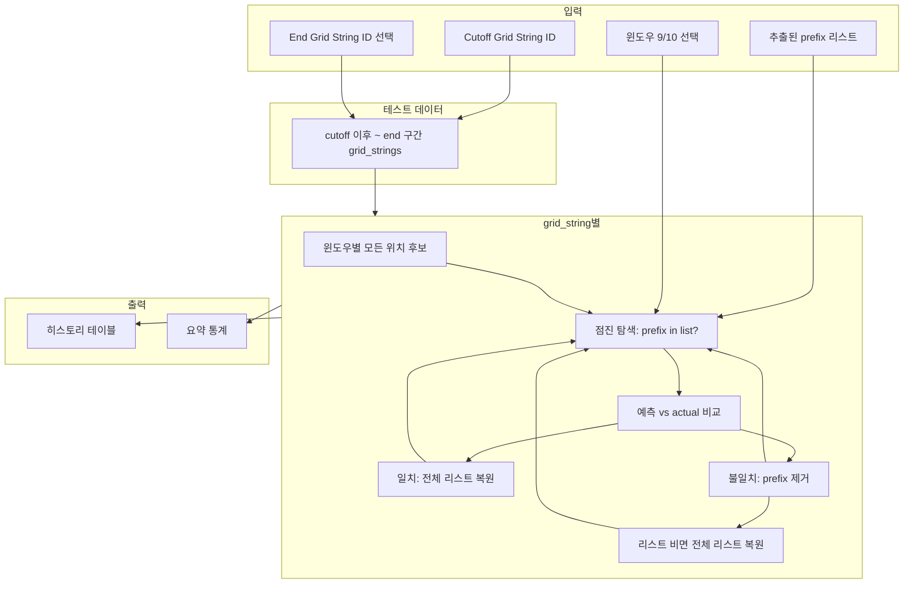

# 윈도우 9·10 Prefix 리스트 추출 계획 (수정안)

- **저장 형태**: JSON ([live_game_prefix_rules.py](live_game_prefix_rules.py) prefix 규칙 형식 참고)
- **최소값**: 임의 설정 없이, 데이터 기반 추출만 적용
- **step_events에 없는 prefix**: 제외
- **원본**: prefix 출현 빈도 + suffix 빈도, 높은 빈도 suffix가 step_events 예측값과 일치하는 prefix만 포함

---

## 1. 저장 형태: JSON (live_game_prefix_rules 참고)

참조: [change_point/live_game_prefix_rules.py](live_game_prefix_rules.py)

- `_export_rules_to_json`: `[{"prefix": "...", "prediction": "B"|"P"}, ...]` (indent=2, ensure_ascii=False)
- `_import_rules_from_json`: 동일 형식 복원, prefix strip·lower, prediction B/P 정규화

**본 추출 JSON 형식** (규칙 호환 + window_size·메타데이터):

- **규칙 배열** `rules`: 라이브에서 사용할 리스트
  - 각 항목: `{"window_size": 9|10, "prefix": "...", "prediction": "B"|"P"}` (필수)
  - 선택 메타: `freq_ngram`, `suffix_freq`, `win_rate_pct`, `total_events`

**구조 예시:**

```json
{
  "window_sizes": [9, 10],
  "generated_at": "2026-03-04T12:00:00",
  "rules": [
    { "window_size": 9, "prefix": "bpbbbbpb", "prediction": "B" },
    { "window_size": 10, "prefix": "bpbbbbpbb", "prediction": "P" }
  ],
  "meta": {
    "total_rules": 42,
    "by_window": { "9": 20, "10": 22 }
  }
}
```

라이브 앱: `rules`만 로드해 `(window_size, prefix) -> prediction` 맵으로 사용. 필요 시 `_import_rules_from_json`를 window_size 포함하도록 확장.

---

## 2. step_events에 없는 prefix는 제외

- 추출 대상 prefix는 **반드시 step_events에 1건 이상 존재** (skipped=0 기준).
- ngram에만 있고 step_events에 없는 prefix는 **제외**.

---

## 3. 원본 출현 빈도 + suffix 빈도 + step_events 예측값 일치

**ngram** (change_point_ngram.db, `ngram_chunks_change_point`, window 9·10):

- `(window_size, prefix)` 별 **prefix 출현 빈도** `freq_ngram` = COUNT(*)
- `(window_size, prefix, suffix)` 별 COUNT → **(window_size, prefix)별 최빈 suffix** 및 그 빈도 `suffix_freq`

**step_events** (sim_results_change_point.db, skipped=0, window 9·10):

- `(window_size, prefix)` 별 **predicted** 의 **최빈값** (mode) = 해당 prefix에 대해 시뮬에서 가장 많이 쓰인 예측 (B/P)

**포함 조건 (데이터 기반, 임의 최소값 없음):**

1. (window_size, prefix)가 **step_events에 존재**
2. **원본 최빈 suffix**와 **step_events 최빈 predicted**가 **일치** (b/p ↔ B/P 대소문자 통일 후 비교)

의미: 원본에서 가장 많이 나온 다음 글자(suffix)가 시뮬 예측값과 같은 prefix만 라이브에 넣어 5연패를 줄임.

**ngram suffix 빈도 집계:**

```sql
SELECT window_size, TRIM(prefix) AS prefix, suffix, COUNT(*) AS cnt
FROM ngram_chunks_change_point
WHERE window_size IN (9, 10)
GROUP BY window_size, TRIM(prefix), suffix
```

→ Python에서 (window_size, prefix)별로 cnt 최대인 suffix를 **최빈 suffix**로 선택.

**step_events 예측 최빈값:** (window_size, prefix)별로 `predicted` 컬럼의 mode (B/P 정규화 후).

---

## 4. 최소값 임의 설정 없이

- `min_freq_ngram`, `min_win_rate_pct`, `min_total` 등 **고정 임계값 사용 안 함**.
- 적용 기준만:
  1. step_events에 있는 (window_size, prefix)만 후보
  2. 후보 중 **원본 최빈 suffix == step_events 최빈 predicted** 인 것만 최종 리스트에 포함
- 선택: 포함된 prefix들의 `freq_ngram`, `win_rate_pct` 분포를 JSON `meta`에 넣어 두고, 운영 시 “상위 N%” 등 필터는 데이터를 본 뒤 결정 가능.

---

## 5. 웹앱으로 구현

- **구현 형태**: Streamlit 웹앱 (change_point 폴더 내 새 파일, 예: `prefix_list_extractor_app.py`).
- **참고**: [change_point_hypothesis_test_app.py](change_point_hypothesis_test_app.py)
  - 상단 경로 설정: `sys.path.insert(0, str(Path(__file__).resolve().parent.parent))` 등으로 프로젝트 루트 지정.
  - `st.set_page_config(page_title=..., page_icon=..., layout="wide")`, 제목·설명 마크다운.
  - 데이터 소스 경로: change_point_ngram.db, sim_results_change_point.db는 앱에서 고정 경로 또는 설정으로 지정 (hypothesis_test_app처럼 프로젝트 기준 상대 경로).
- **앱 구성 (현재 단계)**:
  - **추출**: DB 연결 후 ngram + step_events 집계 → 일치 조건 적용 → `rules` 생성.
  - **결과 표시**: rules 테이블(DataFrame) 표시, window_size/prefix/prediction 및 선택 메타(freq_ngram, suffix_freq, win_rate_pct 등).
  - **JSON 내보내기**: 생성된 규칙을 위 1번 JSON 형식으로 저장, 다운로드 버튼 또는 `change_point/prefix_list_win9_10.json` 저장 버튼.
  - **데이터 새로고침**: hypothesis_test_app처럼 "데이터 새로고침" 버튼으로 DB 재조회 후 재추출 가능.
- **추후 확장 고려 (시뮬레이션)**:
  - 지금 단계에서는 **구현하지 않음**. 아래 6번에서 설계만 반영.

---

## 6. 시뮬레이션 추후 확장 고려 (현재 단계 구현 없음)

- **참고**: [change_point_hypothesis_test_app.py](change_point_hypothesis_test_app.py)의 시뮬레이션 흐름
  - 가설 선택 → 시뮬레이션 설정(cutoff, method, grid_strings 구간) → `batch_validate_*` 호출 → 결과/step_events 저장 및 요약 표시.
- **추후 확장 시 고려 사항**:
  - 이 앱에서 만든 **prefix 리스트(JSON rules)** 를 “가설”처럼 사용해, 동일한 검증 데이터(grid_strings, cutoff)에 대해 “rules에 있는 (window_size, prefix)만 예측하고 나머지는 스킵”하는 시뮬레이션을 돌릴 수 있도록 설계해 둠.
  - UI: 탭 또는 섹션을 "추출 / JSON 내보내기" 와 "시뮬레이션 (추후)" 로 나누어 두면, 나중에 "시뮬레이션" 탭에서 cutoff·구간 선택 후 “현재 로드된 rules로 시뮬 실행” 버튼을 추가하기 쉬움.
  - 데이터 흐름: 추출된 JSON rules → (window_size, prefix) -> prediction 맵 → 검증 루프에서 prefix가 맵에 있을 때만 예측, 없으면 스킵 → step_events/요약 생성. hypothesis_test_app의 `batch_validate_*` + run_summary 저장 패턴 재사용 가능.
- **현재 단계**: 시뮬레이션 탭/기능은 만들지 않고, **탭 이름만 "시뮬레이션 (추후 확장)"** 으로 비워 두거나, 단순히 문서/주석으로 "추후 여기서 rules 기반 시뮬레이션 추가 예정"만 명시.

---

## 7. 구현 작업 정리

1. **추출 로직 (모듈 또는 앱 내부 함수)**
   - ngram: (window_size, prefix)별 `freq_ngram`, (window_size, prefix, suffix)별 count → (window_size, prefix)별 **최빈 suffix** 및 `suffix_freq`
   - step_events: (window_size, prefix)별 total, correct, win_rate_pct + **predicted 최빈값 (mode)**. step_events에 없는 prefix는 후보에서 제외
   - prefix 정규화: TRIM(prefix) / strip() 통일
   - 필터: step_events 존재 + (원본 최빈 suffix ↔ step_events 최빈 predicted 일치)
   - 출력: 조건 만족 항목만 `rules` 배열 (및 meta). JSON 구조는 1번 형식.

2. **웹앱 (Streamlit)**
   - 새 파일: `change_point/prefix_list_extractor_app.py` (또는 동의한 파일명).
   - hypothesis_test_app 참고: 경로 설정, set_page_config, wide 레이아웃.
   - 화면: 추출 실행 → rules 테이블 표시 → JSON 다운로드/저장.
   - 데이터 새로고침 버튼으로 재추출.
   - 시뮬레이션: 구현하지 않고, 탭/섹션 예약 또는 주석으로 추후 확장 고려만 반영.

3. **JSON 저장**
   - 파일 예: `change_point/prefix_list_win9_10.json` (앱에서 저장 버튼으로 쓰거나 다운로드만 제공).

4. **라이브 앱 연동**
   - 윈도우 9·10 모드에서 JSON 로드 → (window_size, prefix) -> prediction 맵 구성.
   - 현재 (window_size, prefix)가 맵에 있을 때만 해당 prediction 반환, 없으면 스킵 (5연패 방지).

---

## 8. 데이터 흐름

```
ngram_chunks_change_point (win 9,10)  →  prefix별 출현 빈도 + suffix별 빈도 → 최빈 suffix
step_events (win 9,10, skipped=0)     →  prefix별 total, correct, win_rate_pct + mode(predicted)
         ↓
step_events에 있는 prefix만 후보
         ↓
원본 최빈 suffix == step_events 예측값  →  일치하는 것만 rules
         ↓
JSON (rules + meta) 저장  →  라이브 앱에서 (window_size, prefix) 존재 시에만 예측, 없으면 스킵
```

---

## 9. 시뮬레이션 구현 계획

추출된 prefix 리스트로 검증 데이터를 점진 탐색하며, 불일치 시 리스트에서 해당 prefix 제거·리스트가 비면 전체 복원 규칙을 적용하는 시뮬레이션. (연속 실패 카운트 상한 없음)

### 9.1 테스트 데이터 선택

- **1) Cutoff grid_string 선택**
  - `preprocessed_grid_strings`(change_point DB)에서 ID·created_at 목록 로드.
  - 사용자가 **기준 Grid String ID (cutoff)** 선택 → **이 ID보다 큰 ID**를 가진 grid_string만 테스트 데이터에 포함.
  - 참고: [change_point_hypothesis_test_app.py](change_point_hypothesis_test_app.py)의 "기준 Grid String ID (이 ID 이후 검증)" 패턴.

- **2) 최종 grid_string 지정 (구간 테스트)**
  - **마지막 검증 Grid String ID (end)** 선택 가능.
  - 선택 시: 테스트 데이터 = **cutoff ID 초과 ~ end ID 이하** 구간의 grid_string만 사용.
  - end 미선택 시: cutoff ID 초과 ~ 끝까지 전체.

### 9.2 검증에 사용할 리스트·윈도우

- **3) 추출된 예측 리스트로 검증**
  - 시뮬레이션 탭에서 사용하는 규칙 = 현재 앱에서 **추출·필터 적용 후** 얻은 prefix 리스트 (또는 JSON 불러오기).
  - 각 규칙: `(window_size, prefix) → prediction` (B/P). prefix 정규화(strip·lower) 적용.

- **4) 윈도우 9·10 선택, 기본값 윈도우 9만**
  - 체크박스: "윈도우 9 사용", "윈도우 10 사용". **기본값: 윈도우 9만 체크** (10 비체크).
  - 선택된 window_size만 시뮬레이션에서 사용. **앵커는 고려하지 않으며**, 선택한 윈도우 크기로 만들 수 있는 **모든 위치가 검증 후보**가 됨.

### 9.3 시뮬레이션 규칙 (단일 grid_string)

- **5) 기준 grid_string 점진 탐색·리스트 prefix 만나면 비교**
  - 각 테스트 grid_string을 **기준**으로, **앵커 없이** 선택한 윈도우 크기별로 검증 가능한 **모든 위치**를 후보로 점진 탐색.
  - 선택된 window_size 각각에 대해: `pos`를 `window_size - 1`부터 `len(grid_string) - 1`까지 (prefix가 문자열 범위 내인 모든 위치) 순회.
    - `prefix = grid_string[pos - (window_size-1) : pos]`, `actual_suffix = grid_string[pos]`
    - **리스트에 (window_size, prefix)가 있으면**: 예측값 = 리스트의 prediction. **actual_suffix와 예측값 비교**.
    - 리스트에 없으면: 해당 스텝은 스킵(예측 안 함), 다음 위치로 진행.
  - 윈도우 9·10 둘 다 선택된 경우, 같은 grid_string에서 두 윈도우의 후보 위치를 모두 순서대로 검증 (예: pos 오름차순, 같은 pos면 window_size 순).

- **6) 예측 맞음 → 전체 리스트로 계속**
  - 비교 결과 일치: **현재 사용 중인 리스트를 “전체 리스트”로 복원** (이미 전체면 유지). 연속 실패 카운트 0으로 리셋. 다음 위치로 진행.

- **7) 예측 틀림 → 해당 prefix 제거 후 남은 리스트로 탐색**
  - 비교 결과 불일치: **현재 리스트에서 해당 (window_size, prefix) 규칙을 제거**한 리스트를 “현재 리스트”로 갱신. 다음 스텝은 이 갱신된 리스트로 계속 탐색.

- **8) 리스트가 빌 때까지 7번 반복, 비면 전체 리스트 복원 후 계속**
  - 위 7번(제거·갱신)을 **현재 리스트에 아이템이 하나도 없어질 때까지** 반복한다.
  - **리스트 아이템 수만큼 연속으로 실패**하면 (한 번 제거할 때마다 하나씩 없어지므로, 결국 리스트가 비게 됨) **전체 리스트로 복원**하고, 그 상태로 계속 검색한다.
  - **연속 실패에 대한 카운트 제한은 없음** (예: 5연패 상한 제거). 리스트가 비는 시점에서만 복원하고 탐색은 끝까지 계속한다.

- **9) 일치 나오면 전체 리스트 복원**
  - 6번과 동일: 일치가 나오는 순간 **현재 리스트를 전체 리스트로 복원** 후 계속.

### 9.4 전체 검증·결과 표시

- **10) 테스트 데이터 전체에 동일 규칙 적용**
  - cutoff(와 선택 시 end)로 정해진 **모든 grid_string**에 대해, 각각 위 5~9 규칙으로 시뮬 실행.
  - grid_string별로 독립: 각 문자열 시작 시 “현재 리스트” = 전체 리스트(초기 복사본)부터 시작.

- **11) 검증 스텝 히스토리 테이블**
  - 스텝별로 기록: grid_string_id(또는 식별자), step 번호, position, window_size, prefix, predicted, actual, is_correct, (선택) 현재 리스트 크기, 스킵 여부 등.
  - UI: **히스토리 테이블**로 표시해 사용자가 각 검증 스텝을 확인할 수 있게 구현 (정렬·필터 가능하면 좋음).
  - 요약: 테스트 grid_string 수, 총 스텝 수, 총 예측 수, 총 일치/불일치, grid_string별 최대 연속 실패 등.

### 9.5 데이터 흐름 요약



### 9.6 구현 시 참고

- grid_string 목록·cutoff/end 선택: `change_point_hypothesis_test_app.py`의 `load_preprocessed_grid_strings_cp`, cutoff_opts, end_opts, idx_cutoff, idx_end 패턴.
- 위치·prefix 추출: 앵커 미사용. 선택한 window_size별로 `pos in range(window_size-1, len(grid_string))` 순회, `prefix = grid_string[pos-(window_size-1):pos]`, `actual = grid_string[pos]`.
- 리스트 자료구조: (window_size, prefix) → prediction 맵을 복사본으로 유지하고, 불일치 시 해당 키만 제거한 새 맵으로 교체.
