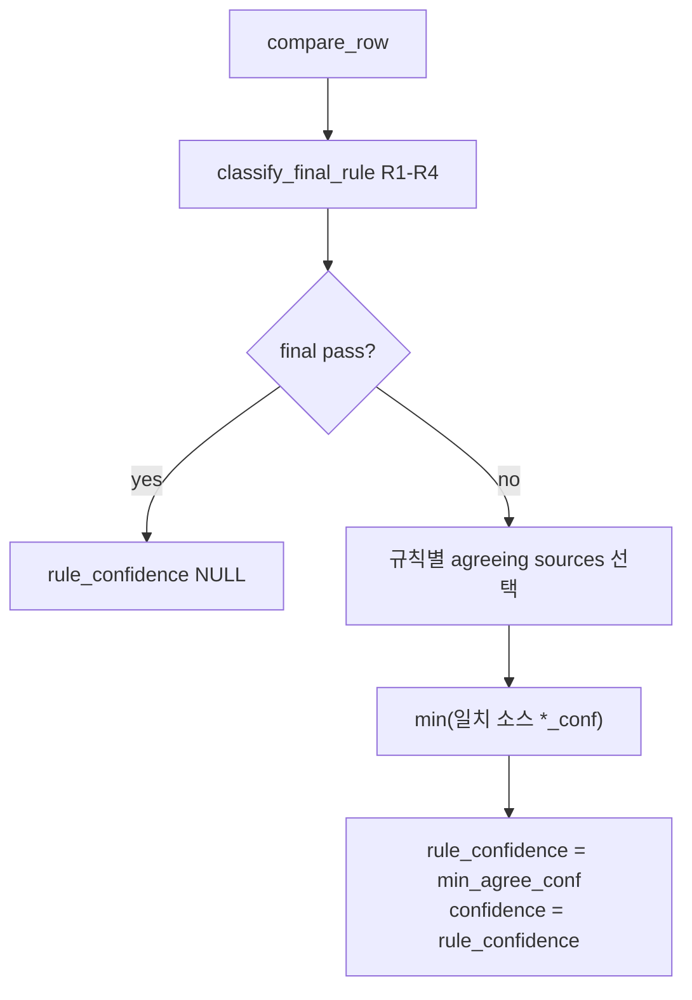

# 최종 테이블 신뢰도 스키마 확장 (C안)

## 현재 상태 (문제)

- **규칙**([`pattern_list2_final_rules.py`](change_point/pattern_list2_final_rules.py)): B/P/pass만 결정
- **confidence**([`_pick_metrics`](change_point/pattern_list2_sim_predictions.py)): ngram → grid → sim lookup **우선순위**로 빌려옴 → 규칙과 출처 불일치 가능
- 스냅샷([`pattern_list3_snapshot.py`](change_point/pattern_list3_snapshot.py))에는 `final_rule`·agree 플래그만 있고, **규칙 신뢰도는 없음**

---

## 신뢰도 측정 개념 (쉬운 설명)

### 한 줄 정의

> **rule_confidence = 「최종 예측 B/P를 뒷받침하는 소스들」의 빈도 신뢰도(%) 중, 가장 보수적인 값(최솟값)**

빈도 신뢰도 자체는 기존과 동일: 각 소스(grid/ngram/sim)에서 `confidence = max(b_ratio, p_ratio)` ([`build_frequency_predictions`](change_point/build_pattern_list_predictions.py)).

### 4개 소스

| list2 | list3 | compare 컬럼 |
|-------|-------|----------------|
| sim | sim | `sim_pred` / `sim_conf` |
| grid 저윈도우 | grid11 | `grid10_pred` / `grid11_pred` + `*_conf` |
| grid 고윈도우 | grid13 | `grid12_pred` / `grid13_pred` + `*_conf` |
| ngram | ngram13 | `ngram12_pred` / `ngram13_pred` + `*_conf` |

list3 규칙 엔진은 [`cmp_row_for_rules`](change_point/pattern_list3_compare.py)로 list2 컬럼명에 alias됨 — confidence 계산도 동일 4소스 모델 사용.

### 계산 순서 (prefix 1건)



### agree_count (보조 지표)

- **agree_count**: 4소스 중 `pred == final` 인 개수 (0~4)
- **agree_count_new_three**: grid 저/고 + ngram 3소스 중 일치 개수 (0~3)

### 규칙별 rule_confidence (사용자 선택: **conservative min**)

| 규칙 | final 결정 | rule_confidence | conf_source |
|------|------------|-----------------|-------------|
| **R1** | grid3-way 일치값 | min(grid10_conf, grid12_conf, ngram_conf) — 존재하는 것만 | `consensus_min` |
| **R2** | sim | sim_conf | `sim` |
| **R3** | ngram (sim=ngram=grid10) | min(sim_conf, ngram_conf, grid10_conf) | `consensus_min` |
| **R5a** | sim (sim=ngram, grid10≠) | sim_conf | `sim` |
| **R5b** | grid 2-of-3 다수값 | min(다수에 투표한 소스들의 conf) | `majority_min` |
| **R4** | pass | NULL | `pass` |

**mean_agree_conf**: 같은 일치 소스들의 평균 — 참고용 저장 (필터/분석용). **rule_confidence는 항상 min**.

### 예시

prefix `bpbbbbpp`, list2에서 R2(sim≠ngram), final=`p`:
- sim_conf=50.1, ngram_conf=55.0 → final=p는 sim 따름
- **rule_confidence = 50.1**, conf_source=`sim`, agree_count=1

R1, 세 grid/ngram 모두 `b`, conf=(58, 62, 55):
- **rule_confidence = 55** (min), agree_count_new_three=3

### 기존 confidence와의 관계

- **`confidence` 컬럼**: livegame·기존 SQL 호환 → **`rule_confidence`와 동일 값**으로 저장
- (선택) **`legacy_confidence`**: 기존 `_pick_metrics` 결과 — 마이그레이션 후 비교·검증용, 1~2주 후 제거 가능

---

## 추가 컬럼 (simulation_predictions_change_point)

[`pattern_list2_sim_predictions.py`](change_point/pattern_list2_sim_predictions.py) / [`pattern_list3_sim_predictions.py`](change_point/pattern_list3_sim_predictions.py) `SIM_DDL` 확장:

| 컬럼 | 타입 | 설명 |
|------|------|------|
| `final_rule` | TEXT | R1 / R2 / R3 / R4 / R5 |
| `rule_version` | TEXT | `final_pred_v3` 등 활성 규칙 세트 |
| `agree_count` | INTEGER | final과 pred 일치 소스 수 (0~4) |
| `agree_count_new_three` | INTEGER | grid+ngram 3소스 일치 수 (0~3) |
| `rule_confidence` | REAL | 규칙별 min 신뢰도 (%) |
| `conf_source` | TEXT | sim / ngram / grid10 / consensus_min / majority_min / pass |
| `min_agree_conf` | REAL | = rule_confidence (명시적) |
| `mean_agree_conf` | REAL | 일치 소스 conf 평균 |
| `legacy_confidence` | REAL | (선택) 구 `_pick_metrics` confidence |

기존: `predicted_value`, `b_ratio`, `p_ratio`, `pred_frequency`, `sim_win_rate_pct` 유지.

**마이그레이션**: `ensure_simulation_predictions_table()`에서 `PRAGMA table_info` 후 없는 컬럼만 `ALTER TABLE ADD COLUMN` (기존 TEST/LIVE DB 보존).

---

## 구현 구조

### 1. 공통 모듈 (신규)

[`change_point/pattern_list_final_confidence.py`](change_point/pattern_list_final_confidence.py)

```python
def compute_final_confidence(
    row: pd.Series,
    *,
    final_rule: str,
    final_pred: str,
    profile: Literal["list2", "list3"],
) -> dict:
    """returns final_rule, agree_count, agree_count_new_three,
       rule_confidence, conf_source, min_agree_conf, mean_agree_conf,
       legacy_confidence (optional)"""
```

- list2/list3 소스 컬럼 매핑만 분기 (`grid10_conf` vs `grid11_conf` 등)
- list3는 `cmp_row_for_rules` 이후 row(list2 alias)로 호출

### 2. sim_predictions 빌드 수정

[`pattern_list2_sim_predictions.py`](change_point/pattern_list2_sim_predictions.py), [`pattern_list3_sim_predictions.py`](change_point/pattern_list3_sim_predictions.py):

- `build_simulation_predictions_df`:
  - `classify_final_rule_fn(row)` + `final_pred_fn(row)` 호출
  - `compute_final_confidence(...)` 결과 merge
  - `confidence = rule_confidence` (pass면 NULL)
  - `_pick_metrics` → `legacy_confidence`만 (또는 제거 후 legacy 컬럼 생략)
- `save_simulation_predictions` INSERT 컬럼 확장
- `copy_sim_table_to_live` cols 리스트 확장

### 3. 스냅샷 테이블 동기화

[`pattern_list2_snapshot.py`](change_point/pattern_list2_snapshot.py), [`pattern_list3_snapshot.py`](change_point/pattern_list3_snapshot.py):

- `SNAPSHOTS_DDL`에 동일 컬럼 추가 + migrate helper
- `build_snapshot_df`: pred_df에 이미 포함된 컬럼 pass-through (중복 merge 제거)

### 4. Compare 앱 UI

[`pattern_predictions_compare_app_list2.py`](change_point/pattern_predictions_compare_app_list2.py), [`pattern_predictions_compare_app_list3.py`](change_point/pattern_predictions_compare_app_list3.py):

- **simulation 미리보기** 테이블 컬럼: `final_rule`, `rule_confidence`, `conf_source`, `agree_count`, `mean_agree_conf`, (`legacy_confidence`)
- 취합 비교 요약에 선택적 컬럼: `rule_confidence`, `conf_source` (갱신 미리보기와 동일 compute)

### 5. 라이브게임 (최소 변경)

[`livegame_engine.py`](change_point/livegame_engine.py): lookup은 기존 `confidence` 유지 (이제 rule_confidence와 동일).

선택: prefix 패널 caption에 `final_rule · rule_confidence · conf_source` DB에서 읽어 표시 (별도 compare 재계산 불필요).

### 6. pred_history

[`pattern_list2_pred_history.py`](change_point/pattern_list2_pred_history.py), [`pattern_list3_pred_history.py`](change_point/pattern_list3_pred_history.py): 스냅샷 wide 테이블에 `rule_confidence` / `conf_source` 칼럼 추가 (run별).

---

## 검증

1. **단위 테스트** (`tests/test_final_confidence.py` 또는 inline script):
   - R1/R2/R3/R5a/R5b/R4 각 1케이스 — min 집계 확인
   - list2/list3 alias row 동일 로직
2. **갱신 후 DB spot-check**:
   ```sql
   SELECT prefix, predicted_value, final_rule, rule_confidence,
          conf_source, agree_count, legacy_confidence, confidence
   FROM simulation_predictions_change_point
   WHERE prefix = 'bpbbbbpp';
   ```
   - `confidence == rule_confidence`
   - R2 케이스: `conf_source='sim'`, `rule_confidence=sim_conf`
3. **compare 앱 미리보기** vs **DB** row 일치
4. **통합 라이브게임** lookup 정상 (confidence 표시)

---

## 갱신 절차 (사용자)

```bash
# compare 앱에서 「예측 테이블 갱신」 또는
python3 change_point/pattern_list3_refresh.py --profile list3 --full
python3 change_point/pattern_list2_refresh.py --profile list2 --full
```

기존 row는 갱신 시 `INSERT OR REPLACE`로 새 컬럼 채워짐.

---

## 범위外 (이번 계획 제외)

- livegame confidence 임계값 필터 (추후 `rule_confidence >= 52` 등)
- LIVE DB 통합 앱 확장
- `legacy_confidence` 영구 유지 여부 — 검증 후 제거 결정
