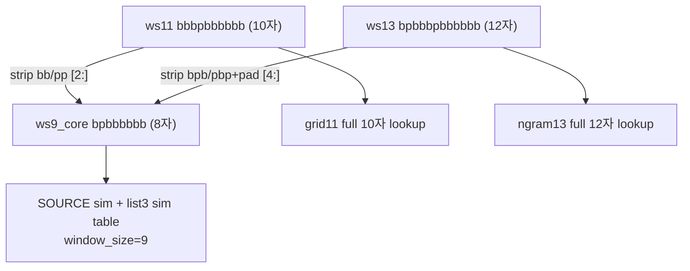

# list3 예측 테이블 · compare 앱 독립 구현 계획

## 핵심 의도 확인 (사용자 피드백 반영)

**ws11 `bbbpbbbbbb` → 예측 lookup 키 `bpbbbbbb` (8자, window_size=9)**

list3 CSV는 ws11/ws13 **full prefix**가 길어졌지만, **최종 예측·라이브 lookup의 의미론적 코어는 list2와 동일한 8자 ws9**입니다.

| 예시 | full prefix | ws9_core (8자) | 추출 |
|------|-------------|----------------|------|
| list2 ws10 | `bbpbbbbbb` (9자) | `bpbbbbbb` | `ws10[1:]` |
| list3 ws11 | `bbbpbbbbbb` (10자) | `bpbbbbbb` | **`ws11[2:]`** |
| list3 ws13 | `bpbbbpbbbbbb` (12자) | `bpbbbbbb` | **`ws13[4:]`** |

검증: `pattern_list3.csv` 78쌍 전부 `ws11[2:] == ws13[4:]` (8자) ✓

**이전 계획 오류 (수정됨):** `ws11[1:]`(9자) + sim ws10 사용 → **사용자 의도와 불일치**. list3도 **ws9_core 8자 + sim ws9 + 최종 sim 테이블 window_size=9**가 맞음.



## list2 vs list3 (수정된 비교표)

| | list2 | list3 |
|---|-------|-------|
| CSV 윈도우 | ws10 + ws12 | ws11 + ws13 |
| full prefix 길이 | 9 / 12 | 10 / 12 |
| **ws9_core (8자)** | `ws10[1:]` = `ws12[3:]` | **`ws11[2:]` = `ws13[4:]`** |
| pad (low/high) | 1자 / 3자 strip | **2자 / 4자 strip** (bb·pp 추가) |
| SOURCE sim lookup | ws9 · 8자 | **ws9 · 8자 (동일)** |
| 최종 sim 테이블 | ws9 · 8자 | **ws9 · 8자 (동일)** |
| grid/ngram lookup | ws10/ws12 full | ws11/ws13 full |

list2 [`to_ws9_prefix`](change_point/pattern_predictions_compare_app.py) 공식 `(low_strip=1, high_strip=3)`을 list3는 **`(2, 4)`**로 복제해야 함. list2 함수에 ws11/ws13을 억지로 넣지 않음.

## 현재 livegame 상태 (아직 list3 미구현)

[`livegame_three_modes_v4_TEST.py`](change_point/livegame_three_modes_v4_TEST.py)는:

- `_lookup_prediction(conn, window_size, prefix)` — **full prefix를 그 window_size로 그대로** 조회
- `window9_10` 모드: window **9, 10만** (ws11 미포함)
- V3 모드: ws11 사용 시 `window_size=11, prefix=10자 full`로 조회 → **8자 ws9_core로 정규화하지 않음**

따라서 **list3 파이프라인·livegame 모두 아직 구현 전**이며, 사용자 의도대로 동작하려면 list3 livegame 복제 시 아래 정규화 **필수**:

```python
def to_ws9_core(prefix: str, window_size: int) -> str:
    if window_size == 9:
        return prefix
    if window_size == 10:
        return prefix[1:]      # list2
    if window_size == 11:
        return prefix[2:]      # list3: bbbp... → bp...
    if window_size == 12:
        return prefix[3:]      # list2 ws12 intermediate (9자, 사용 안 함)
    if window_size == 13:
        return prefix[4:]      # list3
    ...

# lookup: to_ws9_core(full_prefix, window) → window_size=9, prefix=8자
```

예: ws11 `bbbpbbbbbb` → `bpbbbbbb` → `WHERE window_size=9 AND prefix='bpbbbbbb'`

## 권장 전략: list2 모듈 복제 + 최소 공유

**공유 유지**
- [`build_pattern_list_predictions.py`](change_point/build_pattern_list_predictions.py)
- [`pattern_list2_final_rules.py`](change_point/pattern_list2_final_rules.py) — 규칙 로직 재사용 (compare df column alias)

**list3 전용 복제**

| list2 원본 | list3 복제본 | 핵심 변경 |
|------------|--------------|-----------|
| compare pair/load | `pattern_list3_compare.py` | ws11/ws13, **`ws9_core` 8자**, strip (2,4), sim ws9 |
| compare app list2 | `pattern_predictions_compare_app_list3.py` | profile=list3 |
| refresh / sim / snapshot / pred_history | `pattern_list3_*` | list3 imports, WINDOW_SIZE=9 |
| extract ngram ws12 | `extract_pattern_list3_data.py` | ws13 ngram |
| livegame v4 TEST | `livegame_three_modes_v4_list3_TEST.py` | pattern_list3_TEST.db, ws11→ws9 lookup |

## 1. Profile · DB

[`pattern_list_profiles.py`](change_point/pattern_list_profiles.py):

- `LIST3_TEST_PREDICTIONS_DB` = `db_backup/pattern_list3_TEST.db`
- `LIST3_LIVE_PREDICTIONS_DB` = `pattern_list3.db`
- list2와 DB 경로 **절대 공유 금지**

## 2. Compare (`pattern_list3_compare.py`)

| 컬럼 | 의미 |
|------|------|
| `ws11_full` | 10자 |
| `ws13_full` | 12자 |
| **`ws9_core`** | **8자** — `ws11[2:]` = `ws13[4:]` (list2와 동일 이름·길이) |
| `pad11` | ws11[:2] (`bb`/`pp`) |
| `pad13` | ws13[:3] (`bpb`/`pbp`) |

`build_comparison_df("list3")`:
- sim: SOURCE · **window_size=9** · key=`ws9_core`
- grid11 / grid13 / ngram13: full prefix lookup
- final_rules alias: `grid11→grid10`, `grid13→grid12`, `ngram13→ngram12` (list2 엔진 재사용)

## 3. Sim output (`pattern_list3_sim_predictions.py`)

list2와 **동일**:
- `WINDOW_SIZE = 9`
- prefix = **8자 ws9_core**
- sim_lookup = SOURCE ws9

## 4. Livegame list3 (`livegame_three_modes_v4_list3_TEST.py`)

- predictions DB: `pattern_list3_TEST.db`
- 모드 window: `(9, 11)` 또는 V3에 ws11 포함 시 **lookup 전 ws9_core 정규화**
- `_lookup_prediction`: 항상 **`window_size=9, prefix=to_ws9_core(...)`** 로 조회 (list3 의도)
- rule panel: `build_comparison_df("list3")` + ws9_core rule map

## 5. 검증 체크리스트 (수정)

- [ ] `ws11[2:] == ws13[4:]` 78/78, 길이 전부 **8**
- [ ] ws11 `bbbpbbbbbb` → ws9_core `bpbbbbbb`
- [ ] compare sim hit: SOURCE **ws9** (ws10으로 조회하면 miss 증가 — 혼선 검증)
- [ ] TEST sim 테이블: **window_size=9**, prefix **8자**
- [ ] livegame list3: ws11 입력 시 **8자 키**로 예측 표시
- [ ] list2/list3 TEST DB 분리

## 6. 구현 순서

1. profile + DB paths
2. extract_pattern_list3_data
3. pattern_list3_compare (ws9_core 8자)
4. sim / refresh / snapshot / compare app
5. livegame list3 TEST (ws11→ws9 lookup)
6. end-to-end 검증 (`bbbpbbbbbb` → `bpbbbbbb`)

## 7. list2 무영향

- list2 모듈·앱 변경 없음
- list3는 별도 compare/livegame 파일로만 추가
