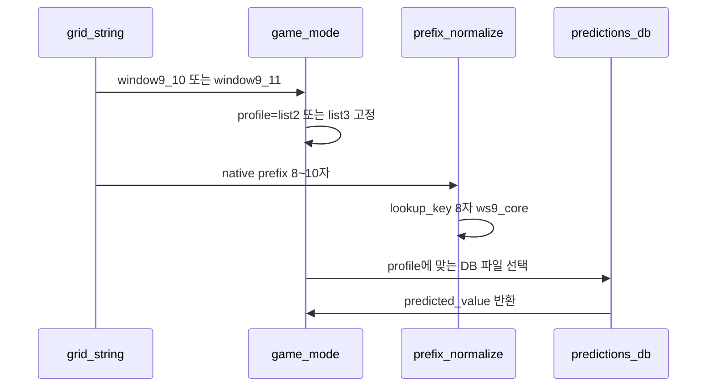
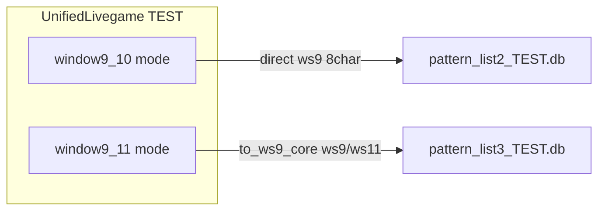

# 통합 라이브게임 앱 (W9_10 + W9_11 · TEST)

## W9 vs W9_10 / W9_11 — 어떤 모드가 예측 테이블과 맞는가

| 모드 | 윈도우 | list2 DB | list3 DB | 예측 테이블 hit | list 설계와의 관계 |
|------|--------|----------|----------|-----------------|-------------------|
| **window9** | 9만 | ws9 8자 direct | ws9 8자 direct | O (ws9 스텝만) | 앵커 진행 로직만 다름. **예측 테이블 전용 모드 아님** |
| **window9_10** | 9→10 | ws9 HIT / ws10 **MISS*** | — | ws9에서 list2 최종 테이블 사용 | list2 `ws10[1:]` 패밀리와 이름·DISPLAY_ORDER 일치 |
| **window9_11** | 9→11 | — | ws9 HIT / **ws11 HIT** (to_ws9_core) | ws9·ws11 모두 list3 테이블 | list3 `ws11[2:]` 정규화 — **list3 파이프라인 핵심** |

\* list2의 ws10 2차 스텝은 현재 `_lookup_prediction`이 `window_size=10`으로 직접 조회해 sim 테이블(ws9 8자만 저장)과 불일치 → 대부분 skip. **게임 플로우(실패 후 ws10 재시도)용**이며, ws9 스텝에서 list2 예측 테이블을 읽는다.

**결론 (사용자 의도에 맞는 선택)**

- **유지**: `window9_10` → [pattern_list2_TEST.db](change_point/db_backup/pattern_list2_TEST.db)
- **유지**: `window9_11` → [pattern_list3_TEST.db](change_point/db_backup/pattern_list3_TEST.db)
- **제거**: `v3` (사용자 확정), `window9` (예측 테이블 관점에서 W9_10/W9_11과 ws9 hit 중복 + list2/list3 패밀리와 이름 불일치)

동일 ws9_core(`bpbbbbbb` 등)가 list2·list3에서 **다른 predicted_value**를 갖는 것은 **서로 다른 DB + 서로 다른 3-way 취합 결과**이므로, 모드별 DB 라우팅만 지키면 자동 유지됩니다.

---

## 같은 prefix일 때 list2/list3 구분 원리 (핵심)

**prefix 문자열 자체에 list2/list3 정보가 들어있지 않습니다.**  
구분은 **「어떤 모드로 조회하느냐」→ 「어느 DB 파일을 열느냐」** 로만 이뤄집니다.

### 1. 저장 구조: DB 파일이 완전히 분리

| | list2 | list3 |
|--|-------|-------|
| TEST DB | `db_backup/pattern_list2_TEST.db` | `db_backup/pattern_list3_TEST.db` |
| 테이블명 | `simulation_predictions_change_point` (동일) | 동일 |
| row 키 | `window_size=9` + 8자 prefix | 동일 |

같은 테이블·같은 prefix 키(`bpbbbbbb`)라도 **SQLite 파일이 다르면 row가 다릅니다.**  
DB 안에 `profile=list2` 같은 컬럼은 없습니다.

### 2. 조회 흐름: 모드가 DB를 결정



**예: lookup_key = `bpbbbbbb` (동일)**

```
W9_10 모드 → pattern_list2_TEST.db 조회 → ('p', 50.1%)   ← list2 3-way 취합 결과
W9_11 모드 → pattern_list3_TEST.db 조회 → ('b', 51.4%)   ← list3 3-way 취합 결과
```

SQL 형태는 양쪽 동일:

```sql
SELECT predicted_value, confidence
FROM simulation_predictions_change_point
WHERE window_size=9 AND prefix='bpbbbbbb' AND method='빈도 기반' AND threshold=0
```

**차이는 conn이 가리키는 파일뿐** (`pattern_list2_TEST.db` vs `pattern_list3_TEST.db`).

### 3. native prefix vs lookup key

grid에서 잘라낸 **native prefix**(8~10자)는 모드마다 다를 수 있지만, DB 조회 키는 8자 `ws9_core`로 맞춥니다.

| 모드 | native prefix 예 | 정규화 | lookup DB |
|------|------------------|--------|-----------|
| W9_10 (L2) | ws9 스텝 8자 `bpbbbbbb` | 그대로 | list2 TEST |
| W9_11 (L3) | ws11 스텝 10자 `bbbpbbbbbb` | `to_ws9_core(...,11)` → `bpbbbbbb` | list3 TEST |
| W9_11 (L3) | ws9 스텝 8자 `bpbbbbbb` | 그대로 | list3 TEST |

list3는 ws11 구간에서 **10자 → 8자 core** 변환이 필요해 `to_ws9_core`를 씁니다.  
list2 W9_10은 ws9 스텝에서 **8자 direct** 조회합니다.  
**어느 DB를 여는지는 여전히 모드(W9_10 vs W9_11)가 결정**합니다.

### 4. 왜 같은 core인데 예측값이 다른가

- list2 compare: ws10/ws12 grid+ngram → 규칙 R1~R5 → list2 TEST DB에 저장
- list3 compare: ws11/ws13 grid+ngram → 동일 규칙 → list3 TEST DB에 저장

30개 prefix는 양쪽 CSV에 공통으로 있지만, **입력 소스(grid/ngram)가 다르므로** 최종 예측이 달라질 수 있습니다 (실측 9/30건 상이).  
이 차이는 **버그가 아니라 설계상 유지해야 할 핵심**입니다.

### 5. 통합 앱에서의 코드 형태 (계획)

```python
MODE_REGISTRY = {
    "window9_10": {"profile": "list2", "db": LIST2_TEST_PREDICTIONS_DB, "lookup": "direct"},
    "window9_11": {"profile": "list3", "db": LIST3_TEST_PREDICTIONS_DB, "lookup": "ws9_core"},
}

def lookup_prediction(mode, window_size, native_prefix):
    cfg = MODE_REGISTRY[mode]           # ← list 구분은 여기서만
    conn = connect(cfg["db"])           # ← DB 파일 분리
    key = normalize(native_prefix, ...) # ← 8자 lookup key
    return query(conn, window_size=9, prefix=key)
```

**정리: prefix로 list2/list3를 구분하지 않습니다. 모드 → DB 파일 매핑으로 구분합니다.**



---

## 목표 아키텍처

**신규 단일 진입점 (TEST만, 사용자 선택)**

```bash
streamlit run change_point/livegame_unified_TEST.py
```

**2모드 병렬**: Cold Start / Live Loop / 히스토리 테이블 모두 W9_10(L2) + W9_11(L3)만.

**기존 3개 앱은 deprecated** (당분간 파일 유지 + docstring에 대체 경로 안내, 또는 삭제):

- [livegame_three_modes_v4_TEST.py](change_point/livegame_three_modes_v4_TEST.py)
- [livegame_three_modes_v4_list3_TEST.py](change_point/livegame_three_modes_v4_list3_TEST.py)
- [livegame_three_modes_v4.py](change_point/livegame_three_modes_v4.py) — LIVE는 이번 범위 제외

---

## 구현 단계

### 1. 모드 레지스트리 + lookup 라우터 (신규)

파일: [change_point/livegame_mode_registry.py](change_point/livegame_mode_registry.py)

```python
@dataclass(frozen=True)
class LivegameMode:
    key: str                    # "window9_10" | "window9_11"
    profile: str                # "list2" | "list3"
    window_sizes: tuple[int, ...]
    lookup: Literal["direct", "ws9_core"]
```

- `window9_10`: profile=list2, windows=(9,10), lookup=direct (list2 [livegame_three_modes_v4_TEST.py](change_point/livegame_three_modes_v4_TEST.py) L201-211 동일)
- `window9_11`: profile=list3, windows=(9,11), lookup=ws9_core ([pattern_list3_ws9_core.to_ws9_core](change_point/pattern_list3_ws9_core.py) + window_size=9 조회)

DB 경로는 [pattern_list_profiles.py](change_point/pattern_list_profiles.py)의 `LIST2_TEST_PREDICTIONS_DB` / `LIST3_TEST_PREDICTIONS_DB` 사용.

### 2. 공통 엔진 추출 (신규)

파일: [change_point/livegame_engine.py](change_point/livegame_engine.py)

[v4_TEST](change_point/livegame_three_modes_v4_TEST.py)에서 v3/window9 분기 제거 후 추출:

- `cold_start_for_mode`, `predict_next_for_mode`, `live_step_for_mode`
- `_lookup_prediction(mode, window_size, prefix)` → registry로 conn + lookup 전략 선택
- conn 캐시: profile별 1 connection (list2 / list3)
- `MODES = ("window9_10", "window9_11")` 만 남김
- cold_start / live_step 내 `mode == "v3"`, `mode == "window9"` 분기 삭제
- `window9_10` / `window9_11` 앵커 진행 로직은 각각 list2/list3 클론에서 그대로 유지

### 3. 통합 Streamlit 앱 (신규)

파일: [change_point/livegame_unified_TEST.py](change_point/livegame_unified_TEST.py)

- UI: 2모드 테이블 (열: Position, **W9_10(L2)**, **W9_11(L3)**)
- B/P 입력 시 2모드 동시 live_step
- `save_live_step_results`: **profile별 DB에 분리 저장**
  - W9_10 history → list2 TEST DB `live_step_results`
  - W9_11 history → list3 TEST DB `live_step_results`
  - dedup key: `(mode, step)` 튜플 (기존 step-only set 충돌 방지)
- 상단 caption: 두 TEST DB 경로 명시

### 4. prefix 규칙 패널 (선택적 확장)

[livegame_prefix_rule_panel.py](change_point/livegame_prefix_rule_panel.py)는 현재 list2 `build_comparison_df("list2")` 고정.

통합 앱에서:

- `profile` 파라미터 추가 → list2는 기존 compare, list3는 `pattern_list3_compare.build_comparison_df("list3")` + `pattern_list3_final_rules`
- 통합 앱에서 2회 호출 또는 1 테이블 2행: W9_10(L2) / W9_11(L3) 각각 규칙·적중률
- `display_order=("window9_10", "window9_11")`

(패널 없이도 게임은 동작; 규칙 표시가 필요하면 이 단계 포함)

### 5. 검증

스크립트 또는 수동 확인:

1. overlap prefix (예: `bpbbbbbb`)에서 W9_10 ≠ W9_11 예측값 표시 확인
2. list3 ws11 native prefix → `to_ws9_core` → list3 DB hit 확인
3. 갱신 후 compare 앱 TEST DB row 수와 livegame lookup 일치
4. `live_step_results`가 list2/list3 TEST DB에 각각 쌓이는지 확인

---

## 변경하지 않는 것 (핵심 유지)

- list2/list3 **별도 predictions DB** 및 갱신 파이프라인
- list3 **ws11[2:] = ws9_core** lookup 규칙
- list2 **direct ws9 8자** lookup (list2 sim 테이블 키)
- compare 앱 2개(list2/list3) — 갱신은 기존과 동일

---

## (선택) 후속 개선 — 이번 범위 밖

- list2 ws10 2차 스텝 lookup을 `to_ws9_core(prefix, 10)`로 정규화하면 ws10 스텝도 list2 테이블 hit 가능 (현재는 skip 위주)
- LIVE 통합 (`pattern_list2.db` + `pattern_list3.db`) — 사용자가 TEST 검증 후 요청 시
