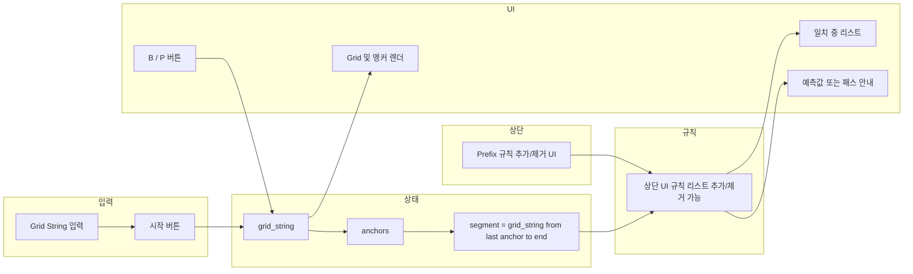

# Prefix 규칙 기반 라이브 게임 앱 계획

## 1. 수정 vs 새 앱 — 결론

**권장: 새 앱 파일로 구현**

| 기준 | 기존 파일 수정 | 새 앱 파일 |
|------|----------------|------------|
| 데이터 소스 | DB (`simulation_predictions_change_point`) | 상단 UI에서 편집 가능한 규칙 리스트 (prefix → B/P, 기본 9개) |
| Cold Start | 앵커별 전수 검증 + DB 조회 | 없음 (표시만) |
| 조건 설정 | 빈도/승률 % 입력·저장 | 제거 요청으로 불필요 |
| 상태/로직 | `state`(current_pos, active_anchor_idx, failure_count, validated_positions 등) | 앵커 + "끝에서부터" suffix 매칭만 |
| 공통 부분 | Grid String·앵커 렌더링, B/P 버튼 | 동일 UI 패턴만 재사용 |

기존 앱은 **윈도우 9 + DB + Cold Start 검증 + 조건(빈도/승률)**에 맞춰 짜여 있어, 요구하신 "조건 제거 + 고정 prefix 리스트 + 끝에서 부분 일치"로 바꾸면 대부분 함수를 갈아엎게 됩니다. 새 파일로 만들면 기존 `change_point/live_game_freq_win2.py`는 그대로 두고, **Grid·앵커 렌더링**만 가져와 재사용하는 편이 유지보수와 이해에 유리합니다.

---

## 2. 요구사항 정리

- **제거**: "1. 조건 설정" 섹션 전체 (빈도 신뢰도 %, 시뮬 승률 %, 저장 버튼, 저장된 조건 표시).
- **유지**: Grid String 입력 → 시작 → **Grid String 및 앵커 표시**만 (기존 `render_grid_string_and_anchors` 활용).
- **Prefix 규칙 (상단, 편집 가능)**  
  - 앱 **상단**에 prefix 규칙 영역을 두고, 사용자가 규칙을 **추가**하거나 **제거**할 수 있게 한다.  
  - 현재 화면에 있는 규칙 리스트만 적용한다 (고정 9개가 아님).  
  - 기본값으로 아래 9개를 초기 로드해 두면 된다.  
  - **리스트 표시**: **prefix 사전순(알파벳순)으로 정렬**해서 보여 준다. 그러면 앞에서부터 같은 문자열로 시작하는 규칙들이 자연스럽게 붙어 있어서, "앞에서부터 모두 일치하는 유사한 것들"을 한눈에 보기 쉽다. 그룹화 UI나 레이블은 두지 않고, 정렬만 적용한다. (중간 부분만 겹치는 것은 고려하지 않음.)

| prefix | 예측 |
|--------|------|
| bpbbbbpb | B |
| bpbbbpbp | B |
| pbpppbbb | P |
| pbpppbpp | B |
| bpbbbbbbpb | B |
| bpbbbbppbb | B |
| bpbpbbpbbb | B |
| pbbbbbbpbb | B |
| pbpppbbbpp | P |

- **매칭 방식**:  
  - **앵커 기준 구간**: "앵커를 기준으로 5~6자리 일치할 때부터 표시" → **마지막 앵커 위치 이후의 suffix**를 사용.  
    - `segment = grid_string[last_anchor_index :]`  
    - `last_anchor_index`는 `anchors[-1]` (가장 마지막 change-point 인덱스).  
    - `len(segment) >= 5` 일 때부터 "일치 후보" 표시 시작.
  - **끝에서 검증**: `segment`가 각 규칙의 **prefix의 suffix**와 일치하는지 검사.  
    - 규칙 prefix가 `segment`로 **끝나면** "일치 중" 후보로 유지.  
    - 새 글자(B/P) 입력 시 `grid_string` 갱신 → 앵커·segment 재계산 → segment로 끝나지 않는 규칙은 제거.
  - **완전 일치**: `segment == prefix`인 규칙이 하나 있으면 그 규칙의 예측값(B/P)을 "예측값"으로 표시.
  - **전혀 일치 없음**: `len(segment) >= 5`인데 어떤 규칙 prefix도 `segment`로 끝나지 않으면 "일치 없음 — 다음 스트링으로 패스" 등으로 사용자에게 표시.

- **예시 (요청 설명)**  
  - 스트링 끝이 `bbpbbb`이면, prefix가 `...bbpbbb`로 끝나는 규칙만 "일치 중"으로 표시 (예: `bpbbbbpb`, 필요 시 `bpbbbpbp` 등 리스트에서 해당하는 것만).  
  - 이후 `b`가 라이브로 추가되면 segment가 `bbpbbbb` 등으로 바뀌고, 이 suffix로 끝나지 않는 규칙은 제거.  
  - 최종적으로 하나의 prefix와 완전 일치하면 해당 예측값(B/P) 표시.

(참고: "리스트 첫 번째와 두 번째가 일치 중"이라는 예시는, segment `bbpbbb`에 대해 두 규칙 모두 suffix로 갖는 해석이면 `bpbbbbpb`만 해당합니다. 구현 시 "segment가 rule_prefix의 suffix와 일치"로 통일하고, 여러 rule이 동시에 일치할 수 있으면 모두 "일치 중"으로 표시하면 됩니다.)

---

## 3. 아키텍처 (데이터/화면 흐름)

- **상태**: `grid_string`, `anchors` (grid_string에서 계산), **prefix 규칙 리스트** (상단 UI에서 편집, session_state 등으로 유지). Cold Start/DB/조건 설정 없음.
- **표시**:  
  - 항상: Grid String + 앵커.  
  - `len(segment) >= 5`일 때: "일치 중" 규칙 목록(prefix + 예측)을 **prefix 사전순**으로 표시 + 완전 일치 시 "예측값" 한 줄.  
  - 일치 후보 0개이면 "일치 없음 — 다음 스트링으로 패스".

---

## 4. 구현 계획 (새 앱 파일 기준)

### 4.1 파일 및 의존성

- **새 파일**: `change_point/live_game_prefix_rules.py` (또는 동일 디렉터리 내 다른 이름).
- **재사용**:  
  - `_anchors_from_grid_string` (앵커 계산).  
  - `render_grid_string_and_anchors` (Grid·앵커 시각화).  
  - 필요 시 `CELLS_PER_ROW` 등 레이아웃 상수.
- **제거/미사용**: `get_change_point_db_connection`, `save_live_run_results`, Cold Start/`predict_next`/`live_step`/`_query_freq_win2_prediction`, 조건 설정 관련 session_state 및 UI.

### 4.2 규칙 정의 및 UI (상단, 추가/제거 가능)

- **규칙 데이터**: `session_state`에 리스트로 유지. 각 항목은 `(prefix, prediction)` 또는 `{"prefix": str, "prediction": "B"|"P"}`.
- **기본값**: 앱 최초 로드 시 위 9개 규칙을 기본 리스트로 설정.
- **상단 UI**  
  - 규칙 테이블(또는 반복 컬럼): 각 행에 prefix 입력란, 예측 선택(B/P), **삭제** 버튼.  
  - **표시 순서**: 규칙 리스트를 **prefix 사전순으로 정렬**한 뒤 렌더링. 앞에서부터 일치하는 항목끼리 인접해 보이도록 하며, 그룹화나 중간 일치는 사용하지 않음.  
  - **규칙 추가** 버튼: 빈 행 또는 기본값 행을 리스트에 추가.  
  - 추가/삭제 시 바로 `session_state`의 규칙 리스트를 갱신하여, 아래 Grid/일치 로직은 "현재 리스트"만 사용.
- 표시 시작 길이: `MIN_SEGMENT_LEN = 5` (또는 5~6으로 설정 가능하게).

### 4.3 핵심 로직 (순수 함수)

- **`get_segment(grid_string, anchors)`**  
  - `anchors`가 비어 있으면 전체 `grid_string`을 segment로 둘지, 또는 "앵커 없음"으로 0자리로 둘지 정책 결정 (권장: 앵커 없으면 `segment = grid_string` 또는 표시 안 함).
  - 있으면 `segment = grid_string[anchors[-1]:]`.
- **`matching_rules(segment, rules)`**  
  - `len(segment) < MIN_SEGMENT_LEN` → 빈 리스트.  
  - 그 외: `rule_prefix.endswith(segment)`인 규칙만 반환.
- **`exact_match_prediction(segment, rules)`**  
  - `segment == rule_prefix`인 규칙이 있으면 해당 예측값(B/P) 반환, 없으면 `None`.

### 4.4 Streamlit UI

1. **제거**: "1. 조건 설정" 섹션 전체.
2. **상단 — Prefix 규칙**  
   - **가장 먼저** "Prefix 규칙" 섹션 배치.  
   - 규칙 리스트를 테이블/폼으로 표시: prefix(텍스트), 예측(B/P 선택), 행별 삭제 버튼.  
   - "규칙 추가" 버튼으로 행 추가.  
   - 변경 시마다 `session_state`의 규칙 리스트 갱신 → 이후 모든 일치/예측은 이 리스트 기준.
3. **유지**:  
   - "Grid String 입력" 텍스트 영역.  
   - "게임 시작"(또는 "시작") 버튼 → 입력값으로 `grid_string` 설정, `session_state`에 저장.  
   - 초기화 버튼 → 결과/상태 클리어 (규칙 리스트는 유지).
4. **표시 (시작 후)**  
   - `render_grid_string_and_anchors(grid_string, anchors)` 호출.  
   - `segment = get_segment(grid_string, anchors)`.  
   - `len(segment) >= MIN_SEGMENT_LEN`일 때:  
     - `matching = matching_rules(segment, session_state의_규칙_리스트)`.  
     - "일치 중" 리스트: prefix와 예측값을 테이블/리스트로 표시.  
     - `exact_match_prediction(segment, session_state의_규칙_리스트)`가 있으면 "예측값: B" 또는 "예측값: P" 강조 표시.  
     - `matching`이 비어 있으면 "일치 없음 — 다음 스트링으로 패스" 문구.
5. **라이브 업데이트**: B / P 버튼 → `grid_string += "b"` 또는 `"p"` → `session_state` 갱신 → `st.rerun()`. (앵커는 매번 `_anchors_from_grid_string(grid_string)`로 재계산.)

### 4.5 엣지 케이스

- **앵커 0개**: segment를 `grid_string` 전체로 두거나, "앵커가 없어 구간을 잡을 수 없음"으로 5자리 미만 처리해 "일치 중" 미표시.
- **segment 길이 5 미만**: "일치 중"·"예측값"·"패스" 문구 모두 미표시 (또는 "5자 이상 입력 후 표시" 캡션).
- **여러 규칙 완전 일치**: prefix 길이가 다르므로 동일 segment에 두 개 동시 완전 일치는 없음. 하나만 완전 일치 시 그 예측값 표시.

---

## 5. 요약

- **새 앱 파일**로 구현하는 것을 권장하며, 기존 `live_game_freq_win2.py`는 수정하지 않고 참고만 합니다.
- 조건 설정은 완전 제거하고, **Prefix 규칙을 앱 상단에 두어** 사용자가 규칙을 **추가·제거**할 수 있게 하고, **현재 리스트만** 적용합니다 (기본 9개 초기값).
- Grid String 입력 → 시작 → Grid·앵커 표시를 유지하고, **마지막 앵커 이후 segment**가 5자 이상일 때부터 "끝에서 검증"으로 일치 후보를 보여 주며, 라이브로 B/P 추가 시 후보를 줄여 나가고, 완전 일치 시 예측값, 전혀 일치 없으면 "다음 스트링으로 패스"를 표시합니다.

**구현 결과**: `change_point/live_game_prefix_rules.py` 에 반영됨.
