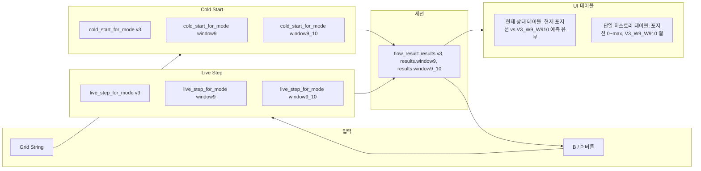

# 3가지 검증 방식 라이브 게임 앱 클론

## 개요

- **원본:** [change_point/change_point_live_game_app_flow_fixed.py](change_point/change_point_live_game_app_flow_fixed.py)
- **대상:** 새 파일 (예: `change_point_live_game_app_three_modes.py`) — 이 파일만 생성/수정하며, 기존 앱은 변경하지 않음.
- **결과물:** Cold Start와 Live Loop를 **세 가지 모드를 병렬로** 실행하는 하나의 앱으로, 다음을 포함:
  - **현재 상태 테이블:** 현재 포지션(다음 예측 위치)에 대해 3가지 검증(V3, W9, W9_10)별 **예측값 있음/없음**을 테이블 한 행으로 표시.
  - **검증 히스토리 테이블 1개:** 포지션 0부터 전체를 행으로 하고, 열은 포지션 + V3 / W9 / W9_10 데이터(예측·실제·일치 등)를 한 테이블에 표시.

---

## 데이터 모델 변경

기존 앱은 단일 `flow_result = { state, history, grid_string, summary }`를 유지한다.

클론에서는 **grid_string 하나를 공유**하고 **모드별 state/history/summary**를 둔다:

```text
flow_result = {
  "grid_string": str,
  "results": {
    "v3":       { "state": {...}, "history": [...], "summary": {...} },
    "window9":  { "state": {...}, "history": [...], "summary": {...} },
    "window9_10": { "state": {...}, "history": [...], "summary": {...} },
  }
}
```

기존 모듈·DB는 변경하지 않으며, 모든 로직은 클론 앱(및 기존 `simulation_predictions_change_point` 사용) 내부에만 둔다.

---

## 모드별 규칙 (클론에서 구현)

| 모드           | 윈도우 집합         | 앵커당 종료 규칙                                                                     |
| -------------- | ------------------- | ------------------------------------------------------------------------------------ |
| **v3**         | (9,10,11,12,13,14)  | 일치 → 다음 앵커; 연속 3회 실패 → 다음 앵커 (기존 로직).                              |
| **window9**    | (9,)                | 앵커당 1스텝(윈도우 9만), 이후 다음 앵커 (3실패 규칙 없음).                            |
| **window9_10** | (9, 10)             | 일치 → 다음 앵커; 아니면 10 시도; 2스텝 또는 일치 후 → 다음 앵커 (3실패 규칙 없음).   |

공통: 동일한 앵커(체인지포인트), 동일한 `current_pos` 기반 다음 앵커 선택(`_first_anchor_from_position`), 동일 DB 테이블 및 (method, threshold). 윈도우 집합과 종료 규칙만 다름.

---

## 구현 단계

### 1. 앱 파일 클론

- [change_point_live_game_app_flow_fixed.py](change_point/change_point_live_game_app_flow_fixed.py)를 `change_point/change_point_live_game_app_three_modes.py`로 복사.
- 페이지 제목/캡션을 "3가지 검증 방식" 버전임이 드러나도록 수정 (예: "Change-point 플로우 라이브 게임 (3가지 검증 방식)").

### 2. 모드 파라미터 및 상수 도입

- `MODES = ("v3", "window9", "window9_10")` 및 모드별 윈도우 튜플 정의:
  - `WINDOW_SIZES_V3 = (9, 10, 11, 12, 13, 14)`
  - `WINDOW_SIZES_W9 = (9,)`
  - `WINDOW_SIZES_W9_10 = (9, 10)`
- 해당 모드의 튜플을 반환하는 헬퍼 `_window_sizes_for_mode(mode)` 추가.
- **Window9:** `MAX_CONSECUTIVE_FAILURES` 없음 (실질적으로 앵커당 1스텝).
- **Window9_10:** 앵커당 일치 시 또는 9·10 둘 다 시도한 후 종료 (3실패 규칙 없음).

### 3. Cold Start를 모드별로 파라미터화

- 기존 `cold_start` 본문을 `cold_start_for_mode(grid_string, mode)`로 리팩터:
  - 전역 `WINDOW_SIZES` 대신 `_window_sizes_for_mode(mode)` 사용.
  - **window9:** 앵커 루프에서 윈도우 크기 9만 실행; 검증 1회(또는 스킵) 후 `current_pos = pos + 1`, `anchor_idx += 1`(또는 동등 처리) 후 다음 앵커로. 연속 3실패 분기 없음.
  - **window9_10:** 앵커 루프에서 (9, 10)만 순회; 일치 시 break 후 다음 앵커로; 9·10 둘 다 시도 후에도 일치 없으면 두 번째 스텝 후 다음 앵커로 진행 ([change_point_hypothesis_module.py](change_point/change_point_hypothesis_module.py)의 `validate_first_anchor_window9_10_cp`와 동일한 for-else 패턴 사용; `pos >= len(grid_string)`일 때 `current_pos`와 `anchor_idx`를 진행시켜 무한 루프 방지).
  - **v3:** 기존 동작 유지 (3실패·일치 종료가 있는 기존 루프).
- 모드별 반환 형태: `{ "state": state, "history": history, "summary": summary }` (모드별 반환에 grid_string 포함하지 않음; grid_string은 최상위에서 공유).

### 4. Cold Start 버튼: 3모드 모두 실행

- "게임 시작 (Cold Start)" 클릭 시:
  - `cold_start_for_mode(grid_string, "v3")`, `cold_start_for_mode(grid_string, "window9")`, `cold_start_for_mode(grid_string, "window9_10")` 실행.
  - `flow_result = { "grid_string": grid_string, "results": { "v3": r_v3, "window9": r_w9, "window9_10": r_w910 } }` 설정.
  - 리셋 전까지 세션 동안 하나의 공유 `grid_string` 유지.

### 5. predict_next를 모드별로 파라미터화

- `predict_next_for_mode(state, grid_string, mode)` 추가:
  - `position = len(grid_string)`로 `window = position - anchor + 1` 계산.
  - `_window_sizes_for_mode(mode)`에 있는 윈도우만 허용 (window9는 9만; window9_10은 9 또는 10만).
  - 동일 DB 쿼리; 기존 `predict_next`와 동일한 형태로 반환.

### 6. live_step을 모드별로 파라미터화

- `live_step_for_mode(state, grid_string, history, user_input, mode)` 추가:
  - `_window_sizes_for_mode(mode)` 및 모드별 종료 규칙 사용:
    - **v3:** 기존 로직 (일치 → 다음 앵커; 연속 3실패 → 다음 앵커; 그 외 동일 앵커 유지).
    - **window9:** 앵커당 1스텝: 이 스텝 후(일치 여부 무관) 항상 다음 앵커로 이동 (실패 횟수 없음).
    - **window9_10:** 일치 → 다음 앵커; 아니면 실패 카운트 증가; 해당 앵커에서 2스텝(또는 더 이상 윈도우 없음)이면 다음 앵커로 (3실패 규칙 없음; 앵커당 최대 2스텝).
  - 기존 `live_step`과 동일한 형태로 반환: `{ "state", "history", "grid_string", "step_result" }`.

### 7. B/P 버튼: 3모드 모두 live_step 실행

- B 또는 P 클릭 시:
  - 각 `MODES` 모드에 대해 `live_step_for_mode(flow_result["results"][mode]["state"], gs, flow_result["results"][mode]["history"], user_input, mode)` 호출.
  - `flow_result["results"][mode]`를 해당 모드의 새 state·history로 갱신; `flow_result["grid_string"]`는 새 grid string으로 유지 (모든 모드 동일).

### 8. UI (1): 현재 상태 테이블 — 현재 포지션에 대한 3가지 검증별 예측 유무

- **요구사항:** "현재 상태"를 테이블로 표시하고, **현재 포지션**(다음 예측 위치 = `len(grid_string)`)에 대해 3가지 검증 방식별로 **예측값 있음 / 없음**만 표시.
- **구현:**
  - 작은 테이블 1개 (예: `st.dataframe` 또는 HTML table).
  - 행: 1행 — "현재 포지션 (다음 예측)" 또는 포지션 번호 `len(grid_string)`.
  - 열: **Position** | **V3** | **W9** | **W9_10**.
  - 셀 값: 각 모드에 대해 `predict_next_for_mode(state, grid_string, mode)` 호출 후 `skipped` 또는 `predicted is None`이면 **"없음"**, 아니면 **"있음"** (선택적으로 예측값 b/p 함께 표시 가능).
  - 기존 텍스트 형태의 current_pos / active_anchor_idx / failure_count 등은 테이블 위 한 줄 요약으로 두거나 제거하고, "현재 포지션에 대한 3가지 검증 예측 유무" 테이블만 두어도 됨.

### 9. UI (2): 검증 히스토리 — 포지션 0부터 전체, 1개 테이블에 V3 / W9 / W9_10

- **요구사항:** 스텝을 **포지션 0부터 전체**로 표시하고, **포지션별로** V3, W9, W9_10 데이터를 **1개 테이블**에 표시.
- **구현:**
  - **행:** 포지션 0, 1, 2, … , `max_pos` (세 모드 history에 등장하는 최대 position, 또는 `len(grid_string) - 1`까지. "다음 예측" 행을 넣을 경우 `len(grid_string)` 한 행 추가 가능).
  - **열 (예시):**
    - `Position` (0, 1, 2, …)
    - `V3_예측` / `V3_실제` / `V3_일치` (또는 `V3` 한 컬럼에 "예측/실제" 요약)
    - `W9_예측` / `W9_실제` / `W9_일치` (또는 `W9` 한 컬럼)
    - `W9_10_예측` / `W9_10_실제` / `W9_10_일치` (또는 `W9_10` 한 컬럼)
  - **데이터 생성:** 세 모드의 `history` 리스트를 `position` 기준으로 매핑:
    - `by_pos = {}`  # position -> { "v3": {...}, "window9": {...}, "window9_10": {...} }
    - 각 모드의 history를 순회하며 `e["position"]`을 키로 해당 모드의 예측/실제/일치 정보 저장.
    - 행은 `range(0, max_position + 1)` 순서로 생성. 어떤 모드에도 해당 포지션 기록이 없으면 빈 문자열 또는 "-".
  - **함수:** `build_validation_history_table_by_position(flow_result)` → `list[dict]` (한 행 = 한 포지션, 컬럼은 Position + V3/W9/W9_10 관련). 이 결과를 하나의 `st.dataframe`(또는 read-only `st.data_editor`)으로 표시.
  - 기존 3개 테이블(모드별 별도 테이블)은 사용하지 않고, 위 **단일 테이블**만 "검증 히스토리 테이블"로 사용.

### 10. 상태 표시 및 요약 (기타)

- Cold Start 요약: 세 모드별 total_steps, total_predictions, accuracy 등은 기존처럼 3열 또는 3행으로 표시.
- "다음 예측" 상세(예측값 b/p, 신뢰도)는 필요 시 현재 상태 테이블 옆 또는 아래에 짧게 표시 가능.

### 11. 리셋 및 저장

- 초기화: 위와 같이 `flow_result` 비우기 (grid_string과 results를 가진 단일 객체).
- 결과 저장: 한 번의 실행에서 세 가지 history/summary를 모두 저장(예: `save_live_run_results` 페이로드에 mode 키로 확장)하거나, 기존 저장 형식을 유지하고 한 모드만 저장; 한 모드만 저장할 경우 별도 지정이 없으면 V3를 기본 저장. 본 계획은 세 가지를 한 구조(예: `history_by_mode`, `summary_by_mode`)로 저장하는 것을 가정하여, "3가지 검증 방식 모두 표시"와 동일하게 첫 구현에서 저장까지 반영.

---

## 수정/추가 파일 목록

- **신규:** [change_point/change_point_live_game_app_three_modes.py](change_point/change_point_live_game_app_three_modes.py) (위 변경을 반영한 `change_point_live_game_app_flow_fixed.py`의 클론).
- **변경 없음:** [change_point/change_point_live_game_app_flow_fixed.py](change_point/change_point_live_game_app_flow_fixed.py), [change_point/change_point_hypothesis_module.py](change_point/change_point_hypothesis_module.py) 및 그 외 모든 파일.

---

## 플로우 다이어그램 (개요)



---

## 예외·엣지 케이스

- **Window9 / Window9_10에서 pos >= len(grid_string):** `cold_start_for_mode` 및 (해당될 경우) `live_step_for_mode` 모두에서, 현재 앵커에 유효한 위치가 없을 때(예: `pos >= len(grid_string)`) `current_pos`와 `anchor_idx`를 진행시켜 무한 루프를 막는다 (window9_10용 [change_point_hypothesis_module.py](change_point/change_point_hypothesis_module.py)와 동일한 수정).
- **빈 히스토리:** 해당 모드에 아직 히스토리가 없으면 빈 테이블 또는 "히스토리 없음" 표시.
- **합성 앵커:** 기존 앱은 진행 후 `anchor_idx >= len(anchors)`일 때 합성 앵커를 추가하는 경우가 있음; 클론에서 동일 조건 사용 시 모드별로 해당 동작을 재현.
